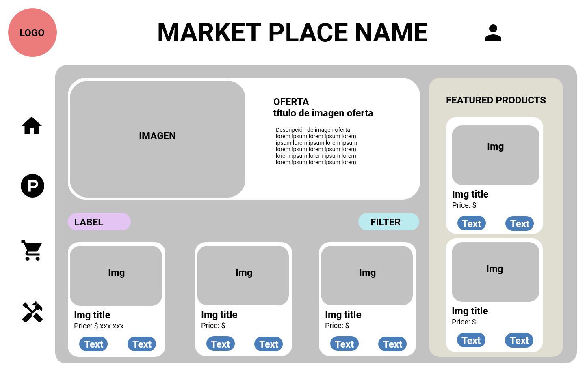
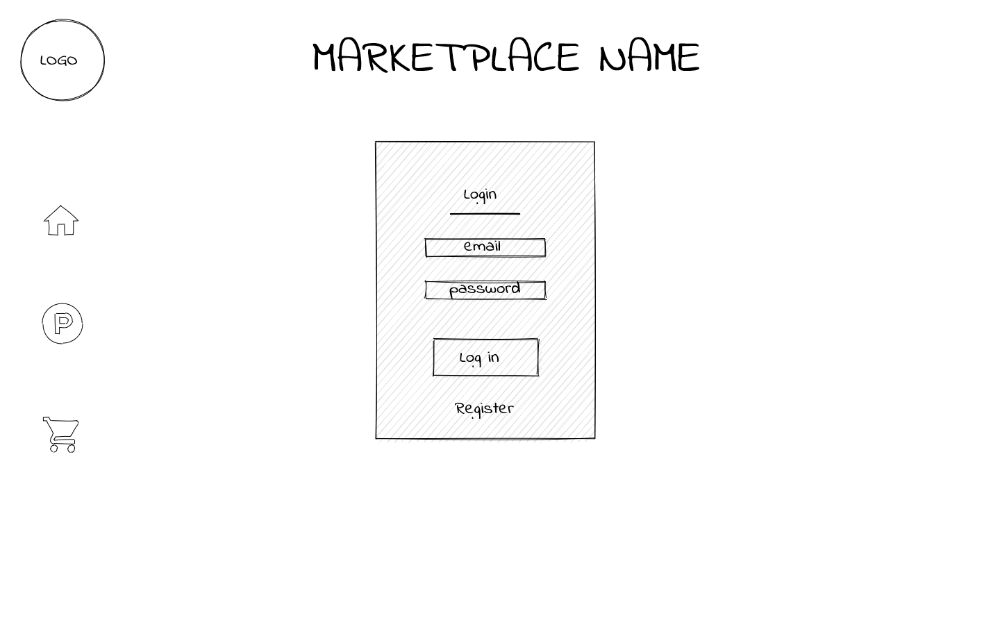
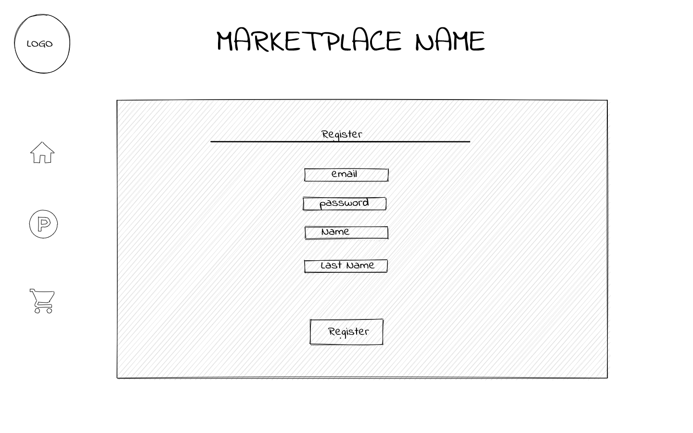
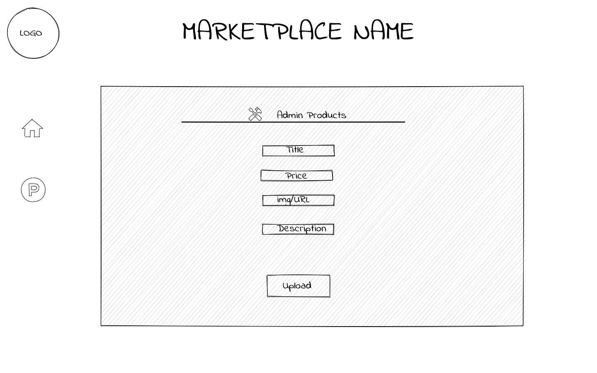

# Proyecto Final Market Place

Esta es la documentación del proyecto final del curso FullStack Javascript de la academia Desafío Latam

## Hito 1 - Diseño y prototipo
### Requerimiento 1: Diseño de la interfaz gráfica
#### Home page

#### Login page

#### Register page

#### Admin page

#### Products Gallery page

