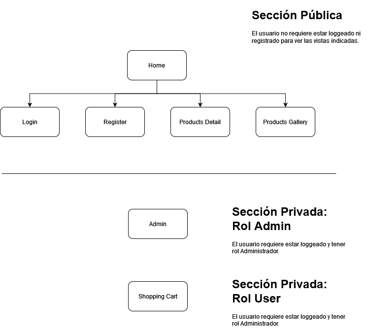

# Proyecto Final Market Place

Esta es la documentación del proyecto final del curso FullStack Javascript de la academia Desafío Latam

## Hito 1 - Diseño y prototipo
### Requerimiento 1: Diseño de la interfaz gráfica

Para responder a este requerimiento, se definen las diferentes vistas que contendrá el sitio, donde
el usuario podra navegar y observar los productos ofrecidos, loggearse o registrarse, seleccionar y comprar productos y además, tendrá la posibilidad de generar un usuario administrador que podrá mantener las tarjetas de los productos ofrecidos. Las vistas son 7: 
- Home: le permite al usuario ver productos destacados y ofertas.
- Login: le permite al usuario loggearse a la aplicación.
- Register: le permite al usuario registrarse.
- Admin: le permitira al usuario con perfil administrador, mantener las tarjetas de productos creando, modificando o eliminando productos.
- Products Gallery: le permite al usuario ver una galeria con todos los productos.
- Products Detail: le permite al usuario ver la descripción de un producto y ponerlo en su carro de compra.
- Shopping Cart: le permite al usuario administrar su carro de compras agregando o eliminando productos.

#### Home page

#### Login page

#### Register page

#### Admin page

#### Products Gallery page

#### Products Detail page

#### Shopping Cart page

### Requerimiento 2: Definición de la navegación entre las vistas

Para responder a este requerimiento, se generarán controles para el acceso a las diferentes vistas
definidas en el requerimiento anterior.

Existirán 2 niveles de control como atributos de las vistas: vistas con atributo público y vistas con atributo privado.

En el caso de las vistas con atributo público, el usuario no tendrá restricciones para mirar productos, en este caso podrá mirar las siguientes páginas sin necesidad de estar loggeado, pero no podrá realizar compras ni tampoco administrar el contenido del sitio:
- Home
- Login
- Register
- Product Gallery
- Products Detail

En el caso de las vistas con atributo privado, su acceso será controlado con la generación de un token de autenticación para los usuarios que ya existan en el sitio. Existirán 2 tipos de usuarios separados por roles:

- Usuario administrador: que posee acceso irrestricto al sitio y demás podrá realizar la administración del contenido del mismo creando, modificando o eliminando productos.

- Usuario cliente: que posee acceso al sitio en modo cliente, pudiendo ver todas las vistas definidas con el atributo público, pero además podrá administrar su carro de compras agregando o eliminando productos antes de comprar.

#### Diagrama de Definición de la navegación 

